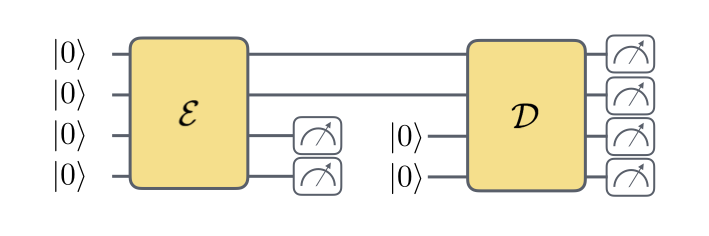
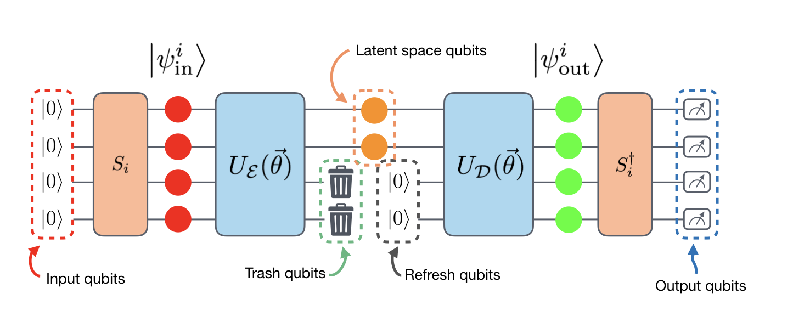

=========================
Introduction to QCompress
=========================

QCompress is a Python framework for the quantum autoencoder (QAE) algorithm.

What is a quantum autoencoder (QAE)?
====================================

Similar to the idea of classical autoencoders, a quantum autoencoder is a function whose parameters are optimized across a training data such that given an :math:`n+k`-qubit input :math:`x`, the autoencoder attempts to reproduce :math:`x`. Part of this process involves expressing the input data set using a fewer number of qubits (using :math:`n` qubits out of :math:`n+k`). This means that if the QAE is successfully trained, the corresponding circuit represents a compressed encoding of the input :math:`x`, which may be useful to applications such as dimension reduction of quantum data. For a more in-depth explanation of the QAE, please refer to the original paper by `Romero et al <https://arxiv.org/abs/1612.02806>`__. In addition, we note that this is one possible realization of a "quantum" autoencoder and that there are other proposed models for the quantum autoencoder.

QAE Model in QCompress
======================

We note that our setup of the quantum autoencoder in QCompress is different from what was proposed by Romero et al. In the original paper, the protocol includes a SWAP test to measure the overlap between the "reference" and "trash" states. However, implementing the SWAP test is generally expensive for today's quantum processors. Instead, we implement two alternative training schemes, described in `Sim et al <https://arxiv.org/abs/1810.10576>`__. 

Before going into the details, we use the following naming conventions for the types of qubits involved in the QAE model in QCompress:

In the current version of QCompress, there are two main training schemes:

1. **Halfway training** (or trash training) - In this scheme, we execute only the state preparation followed by the training circuit and count the probability of measure all 0's on the "trash" qubits (i.e. input qubits that are **not** the latent space qubits).

2. **Full training** - In this scheme, we execute the entire circuit (state preparation, training, un-training, un-state preparation) and count the probability of measuring all 0's on the "output" qubits. There are two possible sub-strategies:

2a. **Full training with reset**: With the ``RESET`` feature in pyQuil, we reset the input qubits (except the latent space qubit) such that these qubits **are** the refresh qubits in the latter half of the QAE circuit. Therefore, in total, this method requires :math:`n_{in}` qubits.

2b. **Full training without reset**: Without the reset feature, we introduce new qubits for the refresh qubits. Therefore, in total, this method requires :math:`2 * n_{in} - n_{latent}` qubits.

**NOTE**: For the loss function, we average over the training set losses and negate the value to cast as a minimization problem. 

Overview of QCompress
=====================

Here, we provide a high-level overview of how to prepare and execute an instance of the QAE algorithm using QCompress. The major steps involved are:

1. Prepare quantum data: generate state preparation circuits, :math:`S_i` for each data point :math:`i`.
2. Select a parametrized circuit to train the QAE.
3. Initialize the QAE instance. 
4. Set up the Forest connection: this is where the user can decide on executing the instance on the simulator or the actual quantum device on Rigetti's QCS. 
5. Split data set into training and test sets.
6. Set initial guess for the parameters, and train the QAE.
7. Evaluate the QAE performance by predicting against the test set.

Examples
========

We provide several Jupyter notebooks to demonstrate the utility of QCompress. We recommend going through the notebooks in the order shown in the table (top-down).

.. csv-table::
   :header: Notebook, Feature(s)

   `qae_h2_demo.ipynb <https://github.com/hsim13372/QCompress/blob/master/examples/qae_h2_demo.ipynb>`__, Simulates the compression of the ground states of the hydrogen molecule. Uses OpenFermion and grove to generate data. Demonstrates the "halfway" training scheme.
   `qae_two_qubit_demo.ipynb <https://github.com/hsim13372/QCompress/blob/master/examples/qae_two_qubit_demo.ipynb>`__, Simulates the compression of a two-qubit data set. Outlines how to run an instance on an actual device. Demonstrates the "full with reset" training scheme.
   `run_landscape_scan.ipynb <https://github.com/hsim13372/QCompress/blob/master/examples/run_landscape_scan.ipynb>`__, Shows user how to run landscape scans for small (few-parameter) instances. Demonstrates setup of the "full with no reset" training scheme.
